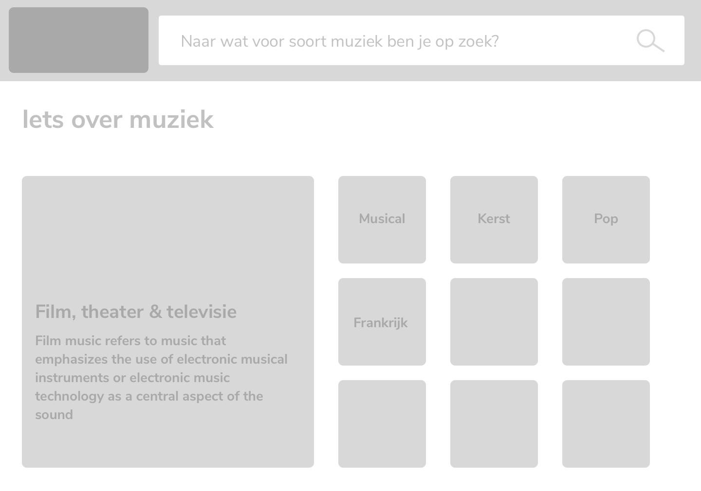

<h1 align="center">Project 1 @cmda-minor-web · 2018-2019</h1>

<p align="center"><b>A website for the OBA (Public Library Amsterdam) which only focuses on music</b>
</p>

<br>

<p align="center">
  <a href="https://github.com/Mennauu/project-1-1819/blob/master/LICENSE">
    
  </a>
</p> 

<br>



<br>

<!-- ☝️ replace this description with a description of your own work -->
## Introduction

<!-- Maybe a table of contents here? 📚 -->
## Table of Contents

- [Installation](#installation)
- [Data](#data)
  - [Authentication and limit](#authentication-and-limit)
  - [Featured data](#featured-data)
  - [Retrieve](#retrieve)
- [Checklist](#checklist)
- [Credits](#credits)
- [Sources](#sources)
  - [API](#api)
- [License](#license)

<!-- How about a section that describes how to install this project? 🤓 -->
## Installation
1. Open your terminal
2. Change the directory to a folder in which you want to place the files
```bash
cd /~path
```
3. Clone the repository (you're going to need [Git](https://www.linode.com/docs/development/version-control/how-to-install-git-on-linux-mac-and-windows/))
```bash
git clone https://github.com/Mennauu/project-1-1819.git
```
4. Load any [live server](https://www.npmjs.com/package/live-server) and serve index.html

<!-- What external data source is featured in your project and what are its properties 🌠 -->
## Data

### Authentication and limit

### Featured data

### Retrieve

<!-- Maybe a checklist of done stuff and stuff still on your wishlist? ✅ -->
## Checklist
- [x] Think of a concept
- [ ] Empty


<!-- Maybe someone helped me 🤔-->
## Credits

<!-- Maybe I used some awesome sources that I can mention 🤔-->
## Sources
Underneath you will find all the sources that were previously mentioned throughout the document and some others which were helpful.

### API

<!-- How about a license here? 📜 (or is it a licence?) 🤷 -->
## License 
See the [LICENSE file](https://github.com/Mennauu/web-app-from-scratch-18-19/blob/master/LICENSE) for license rights and limitations (MIT).

