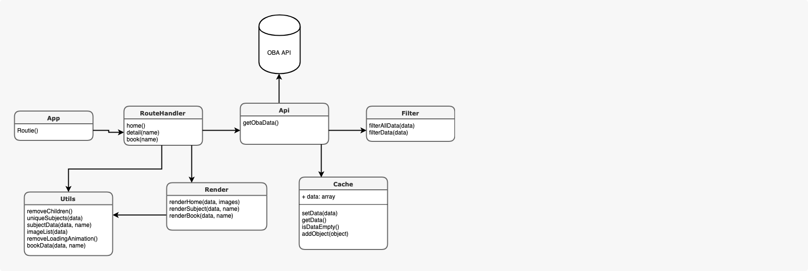

<h1 align="center">Project 1 @cmda-minor-web · 2018-2019</h1>

<p align="center"><b>A website for the OBA (Public Library Amsterdam) which only focuses on audiobooks</b>
</p>

<br>

<p align="center">
  <a href="https://github.com/Mennauu/project-1-1819/blob/master/LICENSE">
    
  </a>
</p> 

<br>


<br>

<!-- ☝️ replace this description with a description of your own work -->
## Introduction
This website is made as part of a project from [@cmda-minor-web 18-19](https://github.com/cmda-minor-web/project-1-1819). In this project I had to make a website based on data from the OBA. The idea was to make something that would be useful in some way for the OBA. The end product is a website about audiobooks where data is retrieved from an the OBA API.

You can find a live demo right here: https://mennauu.github.io/project-1-1819/

<!-- Maybe a table of contents here? 📚 -->
## Table of Contents

- [Installation](#installation)
- [Data](#data)
  - [Authentication and limit](#authentication-and-limit)
  - [Featured data](#featured-data)
  - [Retrieve](#retrieve)
- [Checklist](#checklist)
- [Credits](#credits)
- [Sources](#sources)
  - [API](#api)
- [License](#license)

<!-- How about a section that describes how to install this project? 🤓 -->
## Installation
1. Open your terminal
2. Change the directory to a folder in which you want to place the files
```bash
cd /~path
```
3. Clone the repository (you're going to need [Git](https://www.linode.com/docs/development/version-control/how-to-install-git-on-linux-mac-and-windows/))
```bash
git clone https://github.com/Mennauu/project-1-1819.git
```
4. Load any [live server](https://www.npmjs.com/package/live-server) and serve index.html

<!-- What external data source is featured in your project and what are its properties 🌠 -->
## Data
All the data is taken from the [obaAPI](https://zoeken.oba.nl/api/v1/). It features almost all of the data in one place.

### Authentication and limit
You need a public and secret key to connect with the OBA API. There isn't a fixed limit, but you will be kicked out if you do multiple requests within a second.

### Featured data
- **amount:** Amount of copies
- **availableAmount:** Amount of copies that are available
- **author:** Name of author
- **characteristic:** Physicial description
- **cover_image:** Cover image url
- **description:** Description 
- **pica:** PICA number
- **language:** Language name
- **publication_year:** Year of publication
- **subject:** Subject
- **title:** Title

### Retrieve
The data is retrieved using the [OBA-wrapper created by Wouter](https://github.com/maanlamp/OBA-wrapper). The only thing I have to do is set the API key, and the search query. Because I only want audiobooks I add two facets, cd and audiobook.

```JavaScript
const api = new API({ key: "1e19898c87464e239192c8bfe422f280" })
const iterator = await api.createIterator("search/muziek&facet=Type(cd)&facet=Type(audiobook){60}")
```

### Cache
When data is retrieved by the API it's saved in a variable so that we can use the data while navigating throughout the website to different pages and don't have to do an API request each time.

```JavaScript
let data = []

export const setData = (data) => {
  data = data
}

export const getData = () => {
  return data
}
```

## Code structure
I created two diagrams to show the actors of my code (actor diagram), whom handle functionality in my app, and what happens in my code (interaction diagram).

### Actor diagram


### Interaction diagram


<!-- Maybe a checklist of done stuff and stuff still on your wishlist? ✅ -->
## Checklist
- [x] Think of a concept
- [x] Waste 2 days on working on a concept which can't be made (music from muziekweb)
- [X] Think of a new concept
- [X] Retrieve all audiobooks
- [X] Get unique subjects from audioboks
- [X] Create overview page
- [X] Create subject page (list of books)
- [X] Create detail page
- [ ] Add more information to detail page, like WikiPedia from the author


<!-- Maybe someone helped me 🤔-->
## Credits
**Wouter**: Deserves all the credits for his OBA Wrapper

<!-- Maybe I used some awesome sources that I can mention 🤔-->
## Sources
[AquaBrowser API Documentation](https://zoeken.oba.nl/api/v1/)

<!-- How about a license here? 📜 (or is it a licence?) 🤷 -->
## License 
See the [LICENSE file](https://github.com/cmda-minor-web/project-1-1819/blob/master/LICENSE) for license rights and limitations (MIT).